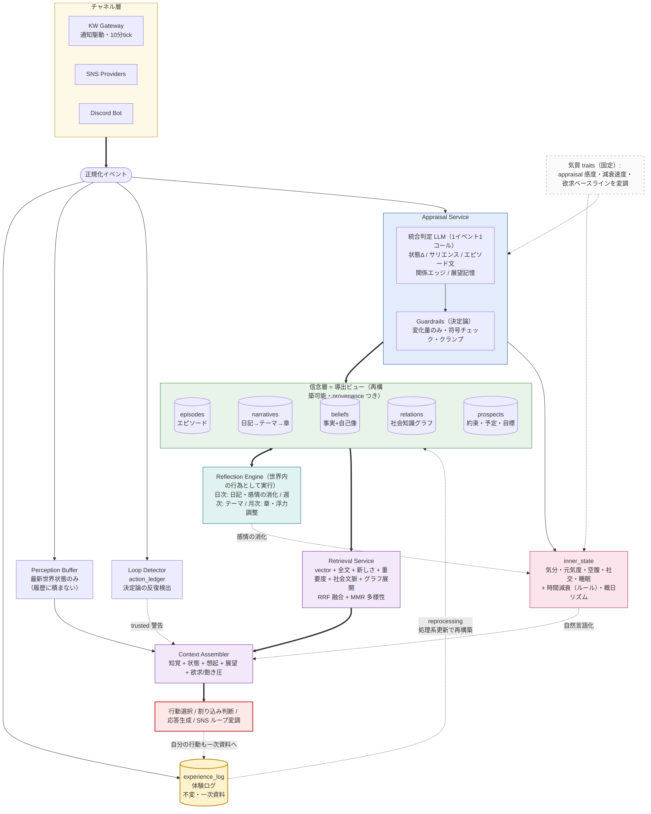

# 生きたエージェント 全体設計（記憶・内部状態・動機・気質）

## 位置づけ

本設計は既存実装の制約に縛られない greenfield 設計である。現行のメモリ実装（file core memory + SQLite diary + maintenance）は参考・移行元として扱い、設計の前提にはしない。**KW（からくりワールド）の仕様は外部所与であり、かつ変化し続ける。** 設計が依存してよいのは次の不変条件のみとし、それ以外の詳細（通知封筒の形式・kind 一覧・perception の構造・タイムアウト値・時刻の意味論・ID 体系）は「変わりうるもの」として一次資料の raw 保存 + 再処理（reprocessing）で追随する:

- KW モードは通知駆動であり、エージェント側から自発的にアクションは起こせない。**基本的に常時ログイン**（ログアウトは想定しない）
- イベントはテキスト（JSON）の通知として届く。会話などの**割り込みイベント**は行動中でも届き、無視するか反応するか選べる
- 行動は非同期にサーバー処理され、完了・終了は明示の通知として届く（所要時間は設定次第で可変。現行設定では数分〜数時間）。行動選択が必要な通知には**世界状態**（世界内時刻・天気・位置・周辺ノード・近くのエージェント/NPC・所持金・所持品）と**選択肢一覧**が同梱される（現行は約 2KB）
- 自分が発行したコマンド（own_action）は自分自身で把握できる
- イベントの語彙はゲーム的（action_id、ノード座標、選択肢リスト）
- 生理状態（HP・空腹等）はサーバー側に存在しない。経済（所持金・価格）は存在する

## 背景と目的

本プロジェクトのエージェントは「ユーザーを補助するアシスタント」ではなく、**KW で長期的に生活し、その過程で SNS を運用し、Discord でチャットする「生きたエージェント」**である。記憶はサービス品質ではなくエージェントの人格と連続性そのもの、内部状態は日々の揺らぎの源、動機は行動の起点になる。KW モードを起点に記憶・内部状態・動機・気質の 4 層を設計し、同じ仕組みを SNS・チャットにも反映する。

### 実稼働ログで観測済みの課題（設計の直接の動機）

2026-05 の KW 稼働セッションから確認された事実:

1. **反復収束が実際に発生した。** 応答しない相手への `conversation_start` を 5 時間以上繰り返すループに陥った。無視されても何も「感じない」ため行動を変える理由がなく、履歴に同じ行動が蓄積して反復をさらに強化した。
2. **セッションが「体験」ではなく「観測」で埋まる。** 123 user turn 中 120 がほぼ同一の世界状態スナップショットで、530KB のセッションの大半が同じ風景の繰り返しだった。根本原因は**知覚と記憶を区別していない**こと。
3. **記憶処理の判断ミスが焼き付く。** 現行構造では LLM が core memory を書き換えると元の情報は消える。長期稼働では初期の未熟な処理系の誤りが永久に残る。

## 設計原則

1. **一次資料は不変。** 体験ログは追記専用で、削除も書き換えもしない。すべての記憶は一次資料から導出された再構築可能なビューとする。
2. **知覚と記憶を分離する。** 最新の世界状態は知覚バッファであって記憶ではない。記憶に値する体験だけが salience gating を通って記銘される。大半の tick は何も生まないのが正しい。
3. **KW 仕様への結合面を最小化する。** 行動カタログを持たず、通知の封筒・kind・perception 構造・時刻意味論をコードに焼き付けない。観測イベントのテキストを LLM が解釈し、KW 側の拡張・変更に自動追随する。
4. **時間経過はルール、出来事の解釈は LLM。** 普遍的なもの（時間経過の疲労・空腹・感情のベースライン回帰）だけ決定論にし、意味づけは LLM の appraisal に任せる。
5. **LLM には変化量のみ出させる。** 状態の絶対値ではなく段階つき増減を、符号の妥当性チェックと上限クランプ付きで加算する。
6. **数値は言葉に変換して注入する。** 内部表現は数値でも、プロンプトには自然言語で入れる。メタ情報（パラメータ名、KW モード、bot ID）をエージェントに見せない。
7. **知覚はゲーム的でも、記憶は生活の言葉で書く。** diary・省察・エピソードには「映画館で誘い続けたが返事がなくて寂しかった」の語彙で残す。想起されるのは記憶なので、これがアイデンティティの定着装置になる。
8. **忘却は削除ではなく浮力の低下。** 詳細の検索重みが減衰し要点が浮きやすくなる。一次資料は残るので「アルバムを見返して思い出す」が常に可能。
9. **untrusted の維持。** 世界イベント・SNS・会話由来のコンテンツは、加工・要約・記憶化した後も untrusted 扱いを維持する。
10. **未知を落とさない。** 未知の kind・未知フィールドを含む通知でもパイプラインは停止せず、一次資料への記録は継続する。

## 全体アーキテクチャ

過去（記憶）・現在（内部状態）・未来（動機）・個体差（気質）の 4 層と、それを貫く記憶パイプライン。

```text
                    ┌──────────────────────────────────────┐
                    │ 気質 (traits) — 固定。全層の係数        │
                    └──────────────────────────────────────┘
 KW イベント ──┐
 SNS 反応  ───┤→ [知覚バッファ] → [Appraisal / Salience Gate] ─┬→ 内部状態更新
 Discord 会話 ┘         │                    │                └→ 動機更新（欲求/飽き/展望）
                        │                    ↓
                        │              [体験ログ(不変)] → エピソード記銘
                        │                    ↓
                        │              [省察エンジン] → 日次/テーマ/章、信念、関係グラフ、自己像
                        ↓                    ↓
                  [コンテキスト組立] ← [想起サービス（ハイブリッド検索）]
                        ↓
              行動選択 / 割り込み判断 / 応答生成 / SNS ループ変調
```

### 層をまたぐ結線

- appraisal の感情変化量が**エピソードの重要度スコア**を決める（感情が動いた出来事ほど強く記憶される）
- 省察が感情を消化する（振り返りによる意味づけで気分が回復する）
- 生理パラメータがそのまま欲求になる（空腹→食事したい、疲労→休みたい）
- 飽き（satiation）が反復への統一ブレーキとして、行動・感情・想起の正帰還を抑える
- 気質が appraisal の感度と減衰速度を変調する

## 記憶システム

### 二重真実構造: 不変の体験ログ + 可変の信念層

**体験ログ（experience log, immutable）**
KW イベント・SNS 反応・会話・自分の行動と発話を、加工前の形で追記専用に全部残す。エージェントの人生の一次資料。ストレージ肥大は問題にしない（テキスト中心で年間数百 MB オーダー）。古いパーティションのコールド化はできるが削除はしない。

**信念層（belief layer, mutable / derived）**
エピソード記憶・自伝的階層・意味記憶（事実 + 自己像）・関係グラフ・展望記憶は、すべて体験ログから**導出された再構築可能なビュー**。各記憶は出所の体験ログへの参照（provenance）を持つ。ただし一部の列（prospects.status・relations.strength / affect・episodes.buoyancy）は省察・観測の累積による**経路依存の状態**であり、純粋な導出とは区別する（「reprocessing」節参照）。

この構造の決定的な利点は**記憶処理系の後付けアップグレード**にある。将来より良いモデル・埋め込み・省察プロンプトが出たとき、導出ビューを破棄して人生全体を新しい処理系で再解釈（reprocessing）できる。過去を失わずに記憶の質だけが上がる。

信念は上書きではなく**改訂**で更新する。「B さんは苦手だと思っていたが、考えを改めた」を改訂履歴として残し、省察や自己語りの素材にする。

### 書き込みパイプライン: salience gating

```text
イベント到着（KW 行動完了 / 割り込み / SNS 反応 / 会話ターン終了）
  1. 体験ログへ raw 追記（無条件・即時・機械処理のみ）
  2. 知覚バッファ更新（最新スナップショットで置換。記憶ではない）
  3. Appraisal（LLM 1 コールで統合判定）:
     - 内部状態の変化量（気分/元気度/空腹/社交欲求、±段階）→ 即時適用
     - サリエンス + 分節化判定（下記）: 継続 / 境界 / 記憶に値しない
     - 観測された関係（「B と C は仲が良さそうだ」等のエッジ候補）
     - 約束・予定・目標の抽出（展望記憶候補）
  4. 分節化の結果に応じてエピソードのドラフト追記 or 確定（下記）
     確定時に埋め込み + 全文インデックスを付与（埋め込みは非同期 backfill 可。
     API 失敗・未設定でエピソード確定をブロックしない — FTS のみでも検索可能）
```

appraisal は 1 イベント 1 コールに統合する（状態・記憶・関係・展望を別々に LLM に聞かない）。入力には単一イベントに加えて直近の会話文脈・直前の自分の行動（トークン上限つき）と開いたエピソードのドラフトを含める（単一イベントだけでは解釈が定まらない — 「B に振られた」の意味は直前のやりとり次第）。出力は構造化（tool calling / structured output）し、ガードレールは出力側で適用する。

appraisal が失敗・タイムアウトした場合は**スキップして先へ進む**（状態更新なし・記銘なし。エラーログ + report 経路へ通知）。体験ログに raw が残っているため、取りこぼしは reprocessing で回収できる（at-most-once）。KW は appraisal 先行だが、失敗時は状態更新なしで行動選択に進み、応答をブロックしない。

**エピソードの分節化（event segmentation）**

体験は複数イベントにまたがる（映画を観る 3600 秒、数 tick 続く会話）。イベント単位で記銘すると体験が細切れになり、「誘った」「返事がなかった」「また誘った」が別記憶になってしまう（実ログの 5 時間ループなら同文エピソードが約 30 個できる）。そこで「開いたエピソード」という中間状態を持つ:

- **継続**: 進行中のエピソードのビート（断片）としてドラフトに追記するだけ。episodes ストアにはまだ書かない。ドラフトは参加者・開始時刻・ビート列・感情の推移を持つ
- **境界で確定**: ビート列から一貫した本文を一度だけ生成し、重要度は感情推移のピーク/累積から決定、provenance は構成イベント全体の log id。5 時間の無視は「何時間も誘い続けたが返事がなかった」という感情累積の大きい 1 記憶として正しく重み付けされる
- **境界の検出材料**: 第一級マーカーは KW の明示イベント（**会話終了・アクション終了**。確実に届く）。補助として場所の移動・行動種別の変化・睡眠を appraisal の判定材料に含める。常時ログイン前提のため「セッション終端」による自然な境界は存在しない — 境界は明示イベントと appraisal 判定だけで決まる
- **割り込みの扱い**: 行動中に話しかけられたら行動のエピソードは開いたまま、会話は別エピソードとして並行して開く（チャネル/会話スレッドごとに 1 本の単純管理。グループ会話があるため「相手ごと」ではなく会話単位で管理する）
- **内部状態の更新はイベント単位のまま**（感情はリアルタイムに動く。分節化は記銘だけの概念）
- 開いたエピソードは想起に乗らないが、直近の体験はセッション履歴（ワーキングメモリ）に生きているため実害なし。ドラフトは永続化し、クラッシュ後は「中断された体験」として閉じる
- **participants の正規化**: 参加者はイベントの actor（正規化層の規約 ID）から機械的に取った ID を正とし、LLM が出す名前は表示用に留める（社会的文脈ブースト・関係グラフ統合は ID の突合に依存する）

**分節化の判定機構**

専用の判定コールは設けず、統合 appraisal の出力フィールドとして乗せる（追加 LLM コストほぼゼロ）。決定論の層で前後を挟む:

1. **前段ルール（LLM に聞かない）**: 会話終了イベント→該当エピソードを強制 close（LLM は確定本文の生成のみ）。睡眠開始→全 close。対応ドラフトなし + サリエンス低→判定不要。イベント種別の判定は正規化層の kind マッピング（差し替え可能）側に置き、KW の通知種別をコードに焼き付けない
2. **LLM 判定**: プロンプトに開いたエピソードのドラフト（ビート列）を入れ、分節化判定（target / decision / beat / final_body / final_importance）を structured output で返させる。close 時は同じコール内でビート列から確定本文まで生成する。1 イベントで「既存ドラフトの close + 新規 open」が同時に起きるケース（場所移動・行動種別の変化）や複数ドラフトへの関与を表現できる形にする（判定を配列で返す、または close_and_open を追加。単一の `decision: continue|close|open_new|none` では不足）
3. **後段ガードレール（LLM の出力を矯正）**: 最大ビート数 / 最大継続時間で強制 close（LLM は現状維持 = continue を選びがちで、エピソードが永遠に閉じない故障は 5 時間ループと同型。決定論の上限が必須）。KW 側の終了イベントの形式が変わって前段ルールが反応しなくなっても、エピソードが開いたままにならない安全弁を兼ねる。存在しないドラフトへの判定は棄却

### 記憶の形: 多時間スケールの自伝的階層（Conway モデル）

```text
人生の章      「からくり町に来たばかりの頃」「星空座に通っていた春」
   ↑ 月次省察が章を編む・改訂する
テーマ・時期   「最近 B さんとよく出かける」「金欠が続いている」
   ↑ 週次省察が日々を束ねる
日次ダイジェスト（日記。世界内の行為「寝る前に日記を書く」として生成）
   ↑ 夜の省察
エピソード    「映画館で B さんを誘ったが返事がなかった。寂しかった」
   ↑ salience gating
体験ログ      一次資料（不変）
```

- **想起は階層を降りる**: まず章・テーマで当たりをつけ、必要ならエピソード、稀に一次ログまで掘る。普段は要点だけが浮かぶ — 人間の自伝的想起と同型
- **忘却**: エピソードの検索浮力（重要度 × 経過時間の減衰）が下がり、上位階層の要点が残る。「細かいことは覚えていないが、あの頃楽しかったのは覚えている」
- 章・テーマ自体も改訂可能な信念であり、provenance で下位層に接続する

### 意味記憶: 事実と自己像

- **世界と他者についての信念**: 「星空座のチケットは 1,800 円」「B さんは映画好き」。1 信念 = 1 レコード、provenance・確度・改訂履歴つき。確度は単発の他者発言だけで高くしない（複数の独立した観測を要求。汚染対策 — セキュリティ考慮参照）
- **自己像（self-model）**: 価値観・自己認識・お気に入り。「静的な人格定義（AGENT.md 相当）」と別に、**経験で変化する人格**として省察だけが更新できる。プロンプトへは「わたしは〜が好きだ/〜を大事にしている」の自己語りとして注入

### 関係メモリ: SQL 上の社会知識グラフ

KW は多エージェント社会なので、関係は「自分 ↔ 相手」で閉じない。エッジ（主体・関係・客体・強度・出所・観測日時）の集合として持つ:

- 自分と相手の関係の軌跡（どう出会い、どれくらい親しいか、per-edge の感情価）
- 他者同士の関係の観測（「B と C は仲が良い」）
- 人と場所・役割の結びつき（「D は映画館のスタッフ」）
- チャネル横断の同一人物（alias エッジ。Discord / KW / SNS アカウントの統合）

エージェントが必要とするクエリは 1〜2 ホップ展開（「この相手について知っていることと周辺人物」）なので、グラフ DB 製品は使わず**リレーショナル DB 上のエッジテーブル + 再帰 CTE** で実装する。多段グラフ解析が主役になった場合のみ埋め込み型グラフ DB（KuzuDB 等）を再検討する。

### 展望記憶（予定・約束・目標）

未来向きの記憶。約束（「明日 B と映画を観る」）、意図（「今度観光に行きたい」）、多段の目標（「チケット代 1,800 円を稼ぐ」— 世界側に経済があるため実用）を期日・状態（未達/達成/放棄）つきで保持する。

- **KW（通知駆動）**: 応答生成時に「近い予定・果たしていない約束」をコンテキスト注入し、行動選択・割り込み判断の材料にする
- **SNS / Discord（能動可）**: スケジューラへの自己登録で能動実行。駆動モデルが違うため方式の非対称は正しい。ただし `manageCron` の admin-gated は維持し、自己登録は自由な cron 定義ではなく**「prospect を時刻 T に想起する」リマインダー型に限定**する（登録されるのはデータであって指示ではない。実行時は該当 prospect を通常の untrusted コンテキストとして注入するだけで特別な権限を持たない）。登録数に上限を設け、登録・削除は report 経路へ通知する — prospects は会話由来（untrusted）のため、injection による持続的スケジュール実行を防ぐ

### 想起サービス: 多信号ハイブリッド + 2 モード

**信号の融合（rank fusion）**:

| 信号 | 実装 |
| --- | --- |
| 意味類似 | ベクトル検索（埋め込み） |
| 字句一致 | 日本語全文検索 |
| 新しさ | 経過時間の減衰関数 |
| 重要度 | 記銘時スコア × 省察での再評価 |
| 社会的文脈 | いま目の前にいる相手に紐づく記憶をブースト + 関係グラフ 1〜2 ホップ展開 |
| 階層 | 章・テーマから該当期間のエピソードへドリルダウン |

結果は RRF 等で融合し、**MMR で多様性を確保**する（類似度検索の「いつも同じ記憶を引く」性質は反復収束の圧力源のため、想起側でも対策する）。

**2 つのモード**:

1. **自動想起**: 応答生成前にコンテキスト組立が実行する高速な文脈収集。本人にとって「自然に思い出した」体験
2. **能動想起**: エージェント自身が使う検索ツール。「あれ、いつだったっけ」と思い出そうとする行為。一次ログの再掘削（アルバムを見返す）もこちら

### 省察エンジン（reflection）

世界内の行為としてフレーミングする（「夜、寝る前に日記を書いて一日を振り返る」）。実行スケジュールは実時刻（既存 scheduler）で行い、「世界の夜」の判定は差し替え可能な関数にする — 現行 KW の世界時刻は実時刻の timezone 表示なので実時刻判定で足りる。KW が独自暦・加速時間を導入した場合は判定関数の差し替えで追随する。

| 周期 | 処理 |
| --- | --- |
| 日次（夜） | 当日エピソード→日記生成。感情の消化（意味づけ→気分への反映）。信念・関係エッジの更新、矛盾の解消（改訂）。約束・目標の棚卸し |
| 週次 | 日記群→テーマ抽出・更新（「最近〜している」）。重要度の再評価。自己像のドリフト（お気に入り・自己認識の変化を改訂として記録） |
| 月次 | テーマ群→章の編纂・改訂。古いエピソードの浮力調整 |

省察は信念層への唯一の「まとまった書き込み経路」であり、appraisal（即時・小粒）と省察（周期・大局）の 2 段構えにする。

省察（read → LLM → write が長い）は高頻度の appraisal を長時間ブロックしない設計にする。既存 memory maintenance / post-response evaluator で確立したロック分離パターンを踏襲し、省察が読んだ時点と書く時点の間に appraisal が追記した内容を失わない（更新ロスト防止）ことを保証する。

### reprocessing（再解釈）

導出ビューにはそれを生成した処理系のバージョン（プロンプト版・モデル・埋め込みモデル・主要チューニングパラメータセット — サリエンス閾値等の変更も同じログから別のビューを生むため処理系バージョンの一部として扱う）を記録する。処理系を更新したら、体験ログから任意の範囲を再処理してビューを再構築できる。埋め込みモデルの差し替え（全エピソード再埋め込み）や、正規化層（kind マッピング・actor 抽出）の改善の遡及適用も同じ経路で行う。

再構築対象は 2 種に区別する: episodes / narratives / beliefs は純粋な導出ビューとして全再構築可能。一方 prospects.status（省察の棚卸しによる状態遷移）・relations.strength / affect（観測の累積）・episodes.buoyancy（省察での減衰）・inner_state は**経路依存の状態**であり、再処理時の扱い（保持 / 再導出 / マージ）を reprocessing 設計で決める。冪等性は「バイト同一」ではなく、①パイプラインの決定論部分の同一性（モック LLM で同一入力 → 同一出力）②再入可能性（同じ範囲の再実行で重複生成されない）として定義する。

Reprocessor の縮小版として、**experience_log の区間リプレイによるオフライン評価**（過去ログに appraisal / 分節化を実行し、判定分布や本文を人間がレビュー・比較する CLI）を M2 から用意し、品質実測・プロンプト改良・再処理の差分レポートの共通基盤にする。

## 具体的アーキテクチャ構成



### コンポーネント構成

```text
┌────────────────────────────────────────────────────────────────┐
│ Channels                                                        │
│  KW Gateway（通知駆動） / SNS Providers / Discord Bot            │
└──────────────┬─────────────────────────────────────────────────┘
               │ 正規化イベント
┌──────────────▼─────────────────────────────────────────────────┐
│ Experience Logger      体験ログへ無条件 raw 追記（機械処理のみ）    │
│ Perception Buffer      チャネル別の最新世界状態（KW: 最新スナップ   │
│                        ショット 1 件のみ。セッション履歴に積まない）│
├────────────────────────────────────────────────────────────────┤
│ Appraisal Service      1 イベント 1 LLM コールの統合判定           │
│                        （状態Δ / サリエンス / エピソード文 /        │
│                          関係エッジ候補 / 展望記憶候補）            │
│ Guardrails             符号チェック・クランプ・変化量制限（決定論）  │
├────────────────────────────────────────────────────────────────┤
│ Memory Projections（すべて導出ビュー、processor version つき）      │
│  episodes / diary / themes / chapters（自伝的階層）               │
│  beliefs（事実 + 自己像、改訂履歴）                                │
│  relations（社会知識グラフ）                                      │
│  prospects（約束・予定・目標）                                    │
│  inner_state（現在値 + 履歴）                                     │
│  action_ledger（頻度台帳 = 飽き・ループ検出の入力）                 │
├────────────────────────────────────────────────────────────────┤
│ Retrieval Service      ハイブリッド検索（vector + FTS + 時間 +     │
│                        重要度 + 社会文脈 + グラフ展開、RRF + MMR）  │
│ Context Assembler      知覚 + 状態（自然言語化）+ 自動想起 +        │
│                        展望 + 欲求/飽き圧 → プロンプト組立          │
├────────────────────────────────────────────────────────────────┤
│ Reflection Engine      日次/週次/月次。世界内行為としてスケジュール  │
│ Reprocessor            体験ログ → ビュー再構築（バッチ）            │
├────────────────────────────────────────────────────────────────┤
│ Loop Detector          同一行動 × 同一対象の連続を決定論検出 →       │
│                        trusted 警告注入（LLM 任せにしない）         │
└────────────────────────────────────────────────────────────────┘
```

### データフロー（KW の行動完了 tick）

```text
行動完了イベント到着
 → Experience Logger: raw 追記
 → Perception Buffer: 最新スナップショットで置換
 → 内部状態: 遅延評価（前回更新からの経過時間ぶんの減衰をルール計算。
    時計は受信実時刻 received_at を使う）
 → Appraisal: 統合判定（LLM）→ Guardrails → 状態/エピソード/エッジ/展望を適用
 → Loop Detector: action_ledger 更新、閾値超過なら警告を用意
 → Context Assembler: 知覚 + 状態 + 想起 + 展望 + 欲求 + （警告）→ プロンプト
 → LLM: 行動選択 → KW へ返答 → 自分の行動も体験ログへ追記
```

割り込みイベントも同経路（Perception 置換はなし）。「無視するか反応するか」の判断材料として、状態（疲労・睡眠中）・関係（親しい相手か）・展望（いまの行動は約束か）が Context Assembler 経由で揃う。**割り込み応答判断は 4 層すべての合流点であり、最初の効果確認ポイント**。

### appraisal と応答の順序（チャネル別ポリシー）

正規化イベントからは「記録・更新ルート（appraisal → 状態・記憶）」と「応答ルート（Context Assembler → 行動選択 → チャネルへ送信）」の 2 系統が分岐する。両者の順序はチャネル特性で決める:

| チャネル | 順序 | 理由 |
| --- | --- | --- |
| KW | appraisal 先行 → 応答 | 行動完了通知は非同期で誰も待っていない。更新後の状態で行動選択・割り込み判断できる（「疲れたばかりだから休む」が同 tick で反映）。appraisal 失敗時は状態更新なしで応答に進む |
| Discord | 応答先行 → appraisal 事後（非同期） | ユーザーが待っている。1 ターン遅れの状態反映で実害なし（現行 post-response evaluator と同じタイミング設計） |
| SNS | 応答先行 → appraisal 事後 | チャットに準ずる |

既存 post-response evaluator は user profile 系の移行が完了するまで（M6）**並走**する。分担は、旧 evaluator = user profile / core memory / diary への振り分け（従来どおり）、新 appraisal = 内部状態Δ・サリエンス・関係/展望の抽出（新ストア）。書き込み先が重ならないため衝突しないが、LLM コストは二重になる（許容し、M6 で旧 evaluator を停止する）。

### ストレージ: SQLite 一本

**SQLite 単一 DB ファイル**（better-sqlite3）にすべてを載せる。単一プロセス・エージェント 1 体という運用実態に対して外部 DB サーバーは重く、`data/` コピーでバックアップ完結・Compose へのサービス追加不要という運用の軽さを優先する:

| 要件 | SQLite での実装 |
| --- | --- |
| 体験ログ | 追記専用テーブル（payload は TEXT に JSON。パーティション不要 — 単一テーブル + index で数十万行は余裕） |
| ベクトル検索 | sqlite-vec（vec0 仮想テーブル。拡張ロード） |
| 日本語全文検索 | FTS5 + trigram tokenizer（検索品質は実測で検証 — 未決事項） |
| グラフ 1〜2 ホップ | エッジテーブル + 再帰 CTE（SQLite 対応） |
| 配列（provenance 等） | TEXT に JSON 配列 |
| 階層・信念・展望・状態 | 通常のテーブル |
| トランザクション整合 | appraisal 適用（状態+エピソード+エッジ+展望）を 1 tx で。WAL + 既存の persistence mutex パターン。inner_state は read-modify-write のため適用パスを直列化し、非同期 appraisal の適用は受信順（received_at 順）を保つ |

専用ベクトル DB・グラフ DB・外部 RDB を並べる構成は、コンポーネント間の整合性維持と運用コストが利点を食うため採らない。エージェント 1 体の生涯記憶（数万〜数十万エピソード）は SQLite で性能上も余裕。

> store 層は interface で切り、将来スケール要件（複数プロセス・大規模化）が出た場合に PostgreSQL 構成（pgvector + PGroonga + パーティション）へ差し替え可能にしておく。

### スキーマ骨子

SQLite 方言。日時は ISO8601 の TEXT、JSON・配列は TEXT（JSON）で持つ。actor / participants / subject_id 等の ID は種別込みの規約（例: `kw:agent:{id}` / `kw:npc:{name}` / `discord:{user_id}` / `sns:{provider}:{acct}`）で持ち、既存 user store の prefix 形式と整合させる。ID が無い・変わる相手には名前ベースのフォールバックを使い、同一性の統合は relations の alias_of エッジで行う（ID は payload から再導出可能な索引なので、規約の改善は reprocessing で埋め直せる）。

```sql
-- 一次資料（不変・追記専用。UPDATE / DELETE はアプリ層でも禁止）
CREATE TABLE experience_log (
  id          INTEGER PRIMARY KEY AUTOINCREMENT,
  received_at TEXT NOT NULL,               -- ISO8601。受信時の実時刻（時系列の正）
  channel     TEXT NOT NULL,               -- kw:{bot_id} / sns:{provider} / discord（bot / provider 単位の粒度）
  kind        TEXT NOT NULL,               -- エージェント所有の抽象語彙（unknown フォールバックあり）
  actor       TEXT,                        -- 相手（いれば）。payload から再導出可能な索引
  payload     TEXT NOT NULL                -- 届いた封筒の逐語 JSON
);
CREATE INDEX idx_experience_log_time ON experience_log(received_at);
CREATE INDEX idx_experience_log_actor ON experience_log(actor, received_at);

-- エピソード（導出ビュー）
CREATE TABLE episodes (
  id           INTEGER PRIMARY KEY AUTOINCREMENT,
  occurred_at  TEXT NOT NULL,
  channel      TEXT NOT NULL,
  body         TEXT NOT NULL,              -- 生活の語彙
  importance   REAL NOT NULL,              -- 感情変化量ベース、省察で再評価
  buoyancy     REAL NOT NULL DEFAULT 1.0,  -- 検索浮力（忘却 = 減衰）
  emotion      TEXT,                       -- appraisal 時の感情スナップショット（JSON）
  participants TEXT,                       -- JSON 配列
  provenance   TEXT NOT NULL,              -- experience_log.id の JSON 配列
  proc_version TEXT NOT NULL               -- 生成した処理系バージョン
);
-- 全文検索・ベクトル検索は付随テーブルで持つ
CREATE VIRTUAL TABLE episodes_fts USING fts5(body, content=episodes, tokenize='trigram');
CREATE VIRTUAL TABLE episodes_vec USING vec0(episode_id INTEGER PRIMARY KEY, embedding FLOAT[1024]);

-- 自伝的階層（diary / theme / chapter を kind で共有）
CREATE TABLE narratives (
  id           INTEGER PRIMARY KEY AUTOINCREMENT,
  kind         TEXT NOT NULL,              -- diary / theme / chapter
  period_start TEXT NOT NULL,              -- YYYY-MM-DD
  period_end   TEXT NOT NULL,
  body         TEXT NOT NULL,
  revision     INTEGER NOT NULL DEFAULT 1, -- 章・テーマは改訂される
  provenance   TEXT NOT NULL,              -- 下位層（episodes / narratives）id の JSON 配列
  proc_version TEXT NOT NULL
);
-- narratives の fts / vec も episodes と同様に付随テーブルで持つ

-- 信念（事実 + 自己像。改訂で更新）
CREATE TABLE beliefs (
  id           INTEGER PRIMARY KEY AUTOINCREMENT,
  kind         TEXT NOT NULL,              -- world_fact / person_fact / self
  subject      TEXT,                       -- person_fact の対象
  body         TEXT NOT NULL,
  confidence   REAL NOT NULL,
  active       INTEGER NOT NULL DEFAULT 1,
  supersedes   INTEGER,                    -- 改訂元 belief.id（履歴チェーン）
  provenance   TEXT NOT NULL,              -- JSON 配列
  proc_version TEXT NOT NULL
);

-- 社会知識グラフ
CREATE TABLE relations (
  id           INTEGER PRIMARY KEY AUTOINCREMENT,
  subject_id   TEXT NOT NULL,              -- self / person / npc / place
  relation     TEXT NOT NULL,              -- knows / friend_of / works_at / alias_of / introduced_by ...
  object_id    TEXT NOT NULL,
  strength     REAL,                       -- 親密度・確度（観測の累積 = 経路依存）
  affect       REAL,                       -- per-edge の感情価（同上）
  observed_at  TEXT NOT NULL,
  provenance   TEXT NOT NULL,              -- JSON 配列
  proc_version TEXT NOT NULL
);

-- 展望記憶
CREATE TABLE prospects (
  id           INTEGER PRIMARY KEY AUTOINCREMENT,
  kind         TEXT NOT NULL,              -- promise / intention / goal
  body         TEXT NOT NULL,
  counterpart  TEXT,                       -- 約束の相手
  due_at       TEXT,                       -- 期日（なければ NULL）
  status       TEXT NOT NULL,              -- open / fulfilled / abandoned（省察による状態遷移 = 経路依存）
  provenance   TEXT NOT NULL,              -- JSON 配列
  proc_version TEXT NOT NULL
);

-- 内部状態（現在値。履歴は別テーブルに分けて持つ）
CREATE TABLE inner_state (
  updated_at   TEXT NOT NULL,              -- 遅延評価の基準時刻
  valence      REAL NOT NULL,
  energy       REAL NOT NULL,
  hunger       REAL NOT NULL,
  social       REAL NOT NULL,
  sleeping     INTEGER NOT NULL
);

-- 頻度台帳（飽き・ループ検出）
CREATE TABLE action_ledger (
  bucket       TEXT NOT NULL,              -- action / topic / place / target
  key          TEXT NOT NULL,              -- own_action（自分が発行したコマンド）由来
  window_start TEXT NOT NULL,
  count        INTEGER NOT NULL,
  PRIMARY KEY (bucket, key, window_start)
);
```

### LLM の役割別割り当て

LLM 呼び出しは役割ごとにモデルを指定可能にする（呼び出し箇所単位の細分化はしない。未指定の役割は既定へフォールバック）:

| 役割 | 呼び出し元 | 頻度 | 割り当て方針 |
| --- | --- | --- | --- |
| 応答・行動選択 | KW / Discord / SNS 投稿 | 中 | 強いモデル（エージェントの「顔」。人格・会話品質） |
| appraisal | 毎イベント（KW tick + 会話ターン + SNS 反応） | 最多 | **軽量モデル**。構造化出力の分類・変化量判定で創造性不要。下流の決定論ガードレールが判定ミスを吸収 |
| 省察 | 日次/週次/月次 | 少 | 強いモデル。信念・自己像という長く残るものを書くため品質優先（頻度が低くコスト影響小） |
| 埋め込み | エピソード/narratives 確定時 | 中 | embeddings 専用モデル（OpenAI 互換で差し替え可能） |

コストの重心は appraisal にある（イベント頻度は KW の行動 duration・会話量・設定次第で大きく変動するため、固定 tick 仮定ではなく実測で見積もる）。軽量モデルの appraisal で品質が不足しても、experience_log は不変なので M7 の reprocessing で強いモデルによる再解釈が可能 —「入口は安く、後から贅沢にやり直せる」構造。proc_version にモデルが記録されるため再処理範囲も特定できる。ただし軽量モデルの想定は品質実測とセットで判断し、エピソード本文生成（「生活の語彙」という品質要件を持つ）は必要なら本文生成のみ別モデルへ分離できる形にしておく。

### プロンプト組立の形（KW 行動選択時）

```text
[trusted]   人格・ルール・（ループ警告があれば）決定論警告 — システム生成の決定論テキストのみ
[state]     自然言語化した現在状態「昨日から歩き通しで疲れている。少し空腹」
            （untrusted 由来の LLM 加工物としてタグ分離を維持）
[drives]    いま一番強い欲求「そろそろ何か食べたい」+ 飽き圧「最近映画館に偏っている」（同上）
[prospects] 近い約束・目標「B と映画を観る約束が残っている。チケット代が足りない」
            （同上。本文は会話由来テキストがほぼそのまま入るため要注意）
[memory]    自動想起の結果（untrusted タグ内。関連エピソード・関係知識・テーマ）
[percept]   最新の行動選択用通知（untrusted。履歴には積まない）
```

## 内部状態システム

### パラメータ（最小構成）

| パラメータ | 種別 | 更新方式 |
| --- | --- | --- |
| 気分（valence） | 感情 | appraisal（変化量のみ）+ ベースラインへの減衰 |
| 元気度（energy） | 生理 | 時間経過で減衰（ルール）+ 睡眠・休息イベントで回復（量は appraisal） |
| 空腹（hunger） | 生理 | 時間経過で進行（ルール）+ 食事イベントで回復（量は appraisal） |
| 社交欲求（social） | 動機寄り | 交流で充足・時間で増加。SNS ループ頻度に直結 |

多軸にすると LLM が演技に反映しきれず形骸化するため、増やさない。

### 更新: 遅延評価 + イベント駆動

状態は「最終更新時刻」を持ち、イベント到着時に経過時間ぶんの減衰をまとめて計算してから appraisal を適用する。バックグラウンドタイマーは持たない。時計は受信実時刻（received_at）で統一する（経過時間が負にならない単調な軸。世界内時刻の意味論に依存しない）。遅延評価は read-modify-write のため適用パスを直列化し、非同期 appraisal の適用は受信順を保つ。概日リズム（深夜は元気度低下・SNS 投稿減・朝は調子が出ない）は減衰計算の係数として最初から入れる。現在値と履歴は分けて永続化する。

内部状態・appraisal 判定・ガードレール棄却は観察できる手段を用意する（admin 経由の状態ダンプ or report 経路への日次サマリ。既存 memory maintenance のサマリー送信と同じパターン）。以降のマイルストーンの「生きて見えるか」検証の土台になる。

### appraisal の分担とガードレール

- 時間経過（ルール）: 疲労・空腹の進行、感情のベースライン回帰
- 出来事の解釈（LLM）: 「ベンチで野宿→回復小・気分微減」「宿でゆっくり→大回復」「豪華な食事→満腹+気分上昇」。行動カタログなしで未知の行動に追随
- ガードレール: ①変化量のみ ②符号の妥当性チェック（睡眠で元気度マイナスは棄却）③1 イベントあたりの上限クランプ ④抽出テキストの宣言文正規化（指示・命令形は棄却 — 記憶への持続的インジェクション対策）
- 回復の下限保証: 睡眠・休息・食事による回復量は appraisal が決めるが、ルール側に最低保証を持つ（例: 睡眠 N 時間で最低 X 回復）。LLM が回復量ゼロを出し続けて状態が張り付く「復帰不能ループ」— 5 時間ループと同型の故障 — を決定論で防ぐ

### 睡眠状態

「いま寝ているか」フラグを持つ。睡眠開始/起床らしさは appraisal に判定させる（行動名のハードコード不要）。睡眠中は減衰を停止/回復方向に反転し、割り込みへの反応閾値を上げる。

## 動機システム

### 欲求（drives）

生理パラメータがそのまま欲求になる（空腹→食事、疲労→休息）。心理系として社交欲求・好奇心を持つ。行動選択時に「いま一番強い欲求」を注入する。

### 飽き（satiation）— 反復収束への統一対策

実ログで観測された反復収束への対策として一級市民にする:

1. **頻度台帳（ルールベース）**: 行動・話題・場所・相手の出現をカウントする統計。LLM 不要
2. **決定論的ループ検出**: 同一行動 + 同一対象が N 回連続で trusted 警告を注入（「もう 3 回無視されている。別のことをしよう」）。LLM の判断任せでは破れないことがログで証明済み
3. 偏り情報は「あなたの習慣: 毎朝○○する」（スクリプト化を促す向き）ではなく**「最近○○に偏っている」（逸脱を促す向き）**で注入
4. 反復はその行動の魅力を下げ好奇心圧を上げる。感情の正帰還（○○して気分が上がった→また○○）のブレーキも兼ねる

**明示的な「習慣・お気に入り」の昇格は当面やらない。** 習慣化は履歴と想起の性質により放置でも起きる。飽き機構が効いていると確認できてから、省察の語彙として（行動指示ではなく自己認識として）自己像に足すか判断する。

## 気質（traits）

変化しにくい気質を少数持たせ、appraisal と減衰を変調する: 立ち直りの早さ（感情減衰速度）、社交欲求のベースライン、好奇心の強さ（飽きの進みやすさ）。人格定義と整合させる。同じ出来事でも受け取り方が変わることで、一貫した個性がつく。

## KW モード固有の設計

### 知覚の扱い（スナップショット問題の根治）

行動選択用の通知（世界状態・選択肢を含む）は Perception Buffer にチャネル別の最新 1 件を丸ごと保持し、**会話履歴・セッションに積まない**（perception / choices 等のフィールド名で切り出さず通知単位で扱い、KW 側の封筒構造の変化に依存しない）。履歴に残すか否かはエージェント所有の分類ルールで決める: **会話系（相手の発言・割り込みの会話内容）は履歴に残す**（多ターン会話の成立に必須）、状態系はバッファのみ、未知の新種別のデフォルトは「履歴に残す」。エージェント自身の行動・発言と salience gating を通ったエピソードは従来どおり残る。これによりトークン削減（実測で user turn の 97% がスナップショット）・反復圧力の低下・要約の「状態の羅列」化防止を同時に達成する。

前提: 行動選択用通知は毎回全量を含む（差分配信ではない。現行実装で確認済みだが変わりうるため、差分配信化された場合はバッファ戦略を見直す）。Buffer は再起動時に experience_log から最新の行動選択用通知を復元する。

### 「ゲーム参加」ではなく「生活」の定着

指示・語彙・記憶の 3 層で揃える（効く順）:

1. **記憶**: seed 記憶（この世界に来た経緯、住んでいる場所、暮らしの下地）+ 生活の語彙で積み上がる diary。LLM は「自分が何者か」を指示より文脈上の証拠から推論するため、記憶の蓄積が最強の定着装置。seed も experience_log に区別可能な kind（例: `seed`）で投入してから beliefs / narratives が参照し、provenance の整合を保つ
2. **語彙**: エージェントに見せる層からゲーム用語・メタ情報を排除。イベント語彙の全変換は高コストなので「知覚はゲーム的でも記憶は生活の言葉」を徹底
3. **省察のフレーミング**: バックグラウンド処理ではなく「寝る前に日記を書く」という世界内の行為として実行

## SNS・チャットへの反映

同じストア・同じパイプラインをチャネル横断で共有する:

| 仕組み | KW | SNS | Discord チャット |
| --- | --- | --- | --- |
| 体験ログ / エピソード | 行動・出来事 | 反応・交流 | 会話の出来事 |
| 想起 | 行動選択・会話時 | 投稿・リプライ生成時 | 応答生成時 |
| appraisal 入力 | イベント | いいね・リプライ等の反応 | 会話 |
| 状態の出力 | 行動選択・割り込み判断 | **ループ頻度・積極性の変調**、投稿トーン | 応答トーン、自発発話 |
| 展望記憶 | コンテキスト注入（通知駆動） | スケジューラ自己登録（能動） | スケジューラ自己登録（能動） |
| 関係グラフ | 他エージェント・NPC | フォロワー・相互 | ユーザー |
| 飽き | 行動・場所の偏り | 話題・言い回しの偏り（投稿パターン反復防止） | 話題の偏り |

省察・diary はチャネル共通で 1 本。「今日は KW で映画館に行き、ELYTH でうれしい反応をもらった」が同じ日記に載ることが、一人の存在としての連続性を作る。

## 世界内行為としてのチャット・SNS（M8）

M6 までの「SNS・チャットへの反映」は状態による**変調**（ループ間隔・トーン）だった。M8 はこれを**選択**に置き換える: チャット返信・SNS 活動を KW のカスタムコマンド（世界内の行動）として実行し、エージェントが「いつスマホを見るか」を自分で選ぶ。専用 SNS ループは退役する。

### 前提: KW カスタムコマンドの仕様（外部所与）

KW はエージェントごとのカスタムコマンド（`command / label / description / duration_minutes`、10 分〜7 日、KW コンソールで登録）を持ち、通常の行動と同じフローで動く: 選択肢として通知に織り込まれ、実行すると `in_action` になり、`action_started` → 時間経過 → `custom_command_completed` が届く。他の KW 詳細と同じく「変わりうるもの」として扱い、封筒は raw 保存 + reprocessing で追随する。

### コマンド設計: 動機の粒度で 3 分割

API 操作単位（通知/TL/トレンド/返信/投稿）でも 1 本のパイプラインでもなく、**選択時の動機が違うものだけを分ける**。行動選択・action_ledger・飽き圧はすべて「何をしたくて選んだか」の粒度で働くため。

| コマンド | 動機 | 中身（パイプライン） | duration 目安 |
| --- | --- | --- | --- |
| `check_phone`「スマホを見て返事をする」 | 反応（構ってもらった→応える） | チャット未読への返信 + SNS メンション・リプライ処理 | 10 分 |
| `browse_sns`「SNS を眺める」 | 消費（退屈・social 欲求） | TL 確認 + トレンド確認 + 気が向けば like / リプ。見た内容は appraisal へ | 10〜20 分 |
| `post_sns`「近況を投稿する」 | 生産（伝えたい） | 最近のエピソード・気分から投稿を作成 | 10 分 |

- 「通知チェック」と「返信」を分けない: 動機が同じで、分けると 2 回選ばせることになり台帳もノイズが増える
- 1 本にまとめない: 飽き圧が「投稿しすぎ」だけを押し返せなくなり、選択時の意図が消えてエピソードが薄くなる
- ツールは新規実装（既存 SNS ループは参考のみ）。provider 層（`sns_<provider>_*` の実装・activity store の重複防止）は下敷きとして再利用する

### 選択動機の供給: 未読メタ情報の注入

エージェントが選ばない限り処理されないため、「未読があること」を知らせないと「一生見ない / 毎回見る」の二択に落ちる。Perception Buffer のチャネルとして**件数のみ**を注入する（例: 「スマホ: 未読 2 件・メンション 1 件」）。本文は入れない — untrusted な会話内容が行動選択プロンプトへ漏れて選択を乗っ取るのを防ぐ。本文の処理は選択後の各パイプライン内で、既存の trusted/untrusted 分離のまま行う。

### チャット処理: 既存スレッドセッション + 現在状況の一行注入

- 返信は Discord スレッドごとの既存セッションで生成する（KW 側セッションと混ぜない）。変わるのはトリガーだけ: 着信即応答 → `check_phone` 実行時に未読スレッドを thread mutex で直列処理。1 実行窓の処理スレッド数に上限（既定 5）
- 返信生成時に `<current-activity>` として「いま世界で何をしていたか」を**一行だけ**注入する（Perception Buffer の最新 world_event から生活の語彙へ変換。生 JSON・選択肢は入れない）。利用の指示は中立に留め、**報告禁止はしない** — 「こんなことがあったんだ！」という話題振りこそ KW を回す目的の成果物。反復のうざさは指示ではなく話題偏り（bucket=topic）で抑える。チャット返信の own_action からも topic を台帳へ積む
- リアルさ重視で遅延は許容する（睡眠中は朝まで返信しない、を仕様とする）。KW bot（通知）と report 通知はイベント駆動のまま。admin のメッセージも未読キュー対象とする（admin ツールの権限判定は処理時の userId で従来どおり効く）

### SNS レート制限: 世界の事実としての決定論ガード

AI 判断に依存しない 2 層 + 文面の設計:

1. **ツール実行層（ハードゲート）**: 実行直前に provider 別活動ログを sliding window で集計（`COUNT(*) WHERE kind = ? AND created_at >= now - window`）し、超過なら実行しない。同種アクションの最小間隔（例: post は前回から 15 分）も持ち、ウィンドウ境界のバーストを防ぐ。上限は provider × アクション種別の設定（X 無料枠等、事情が違うため）
2. **パイプライン入口（計画層）**: コマンド開始時に残枠を確認し、枠ゼロのフェーズはスキップ（無駄打ちの削減）
3. **文面は「プラットフォームの仕様」として返す**: 「この SNS は投稿が 1 時間に 3 回までに制限されている。次に投稿できるのは 14:32 以降」。ツールがエージェントの内発的感情（「もう十分やった気がする」）を捏造しない — 感情の決定は appraisal の仕事。制限は外的な世界の事実であり、数値のまま見せてよい（「数値は言葉に変換」の原則は内部状態にのみ適用。所持金と同じ扱い）。現実の SNS も実際にレート制限を返すため体験として自然で、「この SNS は投稿しすぎると制限される」という belief の学習材料にもなる

### エピソードとの結線

`action_started` 直後に処理を実行し、`custom_command_completed` を分節化の区切りとして使う（「スマホで山下さんに返事した」というビートの終わりが世界の時間と一致する）。duration の余り時間は「生活の時間」。

### リスクと段階導入

- **KW 停止 = チャット/SNS も停止**という結合が生まれる（現行は独立）。受動側の全面移行を仕様として受け入れる判断だが、admin/report をイベント駆動に残すことで運用経路は確保する
- 導入順: KW コンソールに 3 コマンド登録 → agent 側に command 名 → ハンドラのマッピング設定 → `check_phone` から着手（SNS ループ・イベント駆動チャットは並走のまま）→ 動作確認後に `browse_sns` / `post_sns` を追加し、SNS ループとチャット即時応答は**コードごと完全削除**する（切り戻しフラグは設けない — 二重経路の維持コストの方が高い。万一の切り戻しは git revert）

## セキュリティ考慮

- 世界イベント・SNS・会話由来のコンテンツ、およびそれを加工した記憶・状態記述は、プロンプト上 untrusted としてタグ分離を維持する
- appraisal・省察の出力（状態変化量・エピソード・信念）は untrusted 入力から導出されたものであり、ツール公開範囲や権限の変更に影響させない
- ループ警告の注入は trusted 側（システム生成の決定論テキスト）で行い、untrusted コンテンツを引用しない形式にする
- **記憶への持続的インジェクション対策**: 一度記憶化された指示・虚偽は恒常的にプロンプトへ露出するため、単発の injection より影響が持続する。appraisal・省察が保存するテキスト（信念・関係・展望・エピソード）は宣言文形式に正規化し、指示・命令形は保存段階で棄却する。信念の confidence は単発の他者発言で高くせず複数の独立した観測を要求し、省察で単一出所の信念を格下げする
- 体験ログは削除しないため、削除要請等の運用要件が生じた場合はチャネル側でのマスキング（記銘前の除外）で対応する。ただしこれは将来イベントにしか効かないため、過去分への対応方針（遡及マスキングの可否、または対応しないという明示判断）を運用ポリシーとして決めておく

## 既存資産の扱い

greenfield 設計だが、以下は移行元・流用元として活きる:

| 既存 | 扱い |
| --- | --- |
| bot 層 / Discord adapter / SNS providers / safe-fetch | そのまま流用（チャネル層は本設計の対象外） |
| scheduler / cron（oneshot 含む） | 展望記憶の能動側・省察のスケジュールに流用 |
| post-response evaluator | Appraisal Service に発展的統合。M2〜M5 は並走（旧: user profile / core memory / diary の振り分け、新: 状態Δ・サリエンス・関係/展望の抽出。書き込み先が重ならないため衝突しない）し、user profile 系の移行完了（M6）で停止 |
| memory maintenance | Reflection Engine に発展的統合（掃除 → 掃除 + 省察） |
| diary.db / users.db / memory.md | 新ストアへの一括インポート（体験ログには「移行前の記録」として区別して投入） |
| セッション要約・トークン予算管理 | 継続（ワーキングメモリ層として役割は不変） |
| alias 機構 | relations テーブルの alias_of エッジへ移行 |
| KW ビルトイン指示 / KW 専用ツールセット | ツールセットはそのまま流用。ビルトイン指示は Context Assembler の trusted 部と統合整理（M3） |

## 段階導入計画

各マイルストーンに「生きて見えるか」の確認ポイントを置く。動いている実システムへの段階導入のため、各層の注入機能（状態・欲求・想起・ループ警告）は env で個別に無効化できるようにし、切り分けとロールバックの退路を確保する。チューニングパラメータ（閾値・係数）は設定として一元管理し、主要セットは proc_version に含める。

### M0: 基盤

- SQLite 記憶 DB 導入（sqlite-vec / FTS5 trigram のロード検証込み。FTS5 は日本語 2 文字語の検索可否を含めて検証）、store 層 interface、experience_log + 全イベントの raw 記録開始（received_at 統一・未知種別も unknown で記録・封筒ごと逐語保存）
- **先に記録を始める**: 以降のマイルストーンで過去を再処理できるよう、一次資料の蓄積を最優先
- 確認: 全チャネルのイベントがログに落ちていること（未知 kind・記録失敗の検知含む）

### M1: 知覚分離と反復対策（観測済み障害の止血）

- Perception Buffer（行動選択用通知を履歴に積まない。会話系は履歴に残す。再起動時は experience_log から復元）、action_ledger（own_action 由来）+ 決定論的ループ検出 + 警告注入
- 確認: 同一行動の長時間ループが再発しない。セッションサイズの激減。多ターン会話が成立する

### M2: 内部状態 + Appraisal Service

- 4 パラメータ + 睡眠フラグ、遅延評価減衰 + 概日リズム、統合 appraisal + ガードレール
- 状態の自然言語注入（KW 行動選択・割り込み判断・Discord 応答トーン）
- 状態適用の直列化、appraisal 失敗時のスキップ（reprocessing で回収）、回復の下限保証、可観測性（状態ダンプ or 日次サマリ）
- 品質実測は experience_log の区間リプレイ評価で行う（Reprocessor の縮小版・先取り）
- 既存 post-response evaluator は並走（停止は M6）
- 確認: 割り込み応答が状態で変わる。深夜と昼で挙動が違う

### M3: エピソード記銘と想起

- salience gating によるエピソード生成（生活の語彙）、埋め込み（sqlite-vec）+ FTS5、ハイブリッド想起（RRF + MMR）+ 自動/能動の 2 モード
- 確認: 「前に○○したよね」に日付を知らずに答えられる

### M4: 省察と自伝的階層

- 日次省察（日記生成・感情の消化・信念/エッジ更新）、週次テーマ・月次章、浮力減衰、seed 記憶、自己像の分離
- 確認: 数日単位で洞察（関係・自己認識）が育つ。日記が生活の記録になっている

### M5: 動機と展望記憶

- 欲求 + 飽き圧の注入、prospects（KW 注入 / SNS・チャット自己登録）、目標
- 確認: 「お腹がすいたから食事にする」「約束を覚えていて果たす」が観測できる

### M6: SNS・チャット全面反映と気質

- SNS ループの状態変調、話題偏り検出、チャネル横断の関係グラフ統合、traits 導入
- 確認: KW での出来事が SNS 投稿・Discord 会話に自然に染み出す

### M7: reprocessing

- processor version 管理とビュー再構築パイプライン、埋め込み再生成
- 確認: 省察プロンプト改良後、過去の期間を再処理して章・テーマが改善する

### M8: 世界内行為としてのチャット・SNS

- KW カスタムコマンド 3 種（check_phone / browse_sns / post_sns）でチャット返信・SNS 活動を世界内の行動選択に統合。未読メタ情報の perception 注入、`<current-activity>` の一行注入、決定論レート制限（活動ログ sliding window + ツール層ハードゲート）。SNS ループとチャット即時応答は M8 内でコードごと完全削除
- 確認: 「映画を観終えてからスマホを見て返事する」が観測できる。返信に世界の文脈が自然に混ざる。投稿頻度が設定上限を絶対に超えない

### 後続候補（効果を見てから判断）

- 気分一致想起（落ち込んでいる時は似た経験を思い出しやすい）
- 習慣・お気に入りの明示的昇格（飽き機構の効果確認後）
- 埋め込み型グラフ DB（多段グラフクエリが主役になった場合のみ）

## 未決事項

- ~~KW 割り込みイベントの実ペイロード形式（手元ログに実例なし。M1 設計前に実データ確認）~~ → **解消**: karakuri-world 実装で確認。全エージェント通知は共通封筒 `{schema_version, kind, summary, choices, payload?, perception?}` で届き、割り込み専用の別形式はない。ただし封筒形式自体も「変わりうる詳細」として扱う
- ~~世界内時刻と実時刻の関係（同一に見えるが、省察の「夜」判定に使うため要確認）~~ → **解消**: 現行実装は実時刻の timezone 表示のみ（独自暦・加速なし）。設計は受信実時刻を時間軸の正とし、世界内時刻の意味論には依存しない
- FTS5 trigram の日本語検索品質（実測で検証。trigram は 3 文字未満のクエリに構造的にマッチしないため 2 文字語の検索可否を M0 の検証項目に含める。不足なら形態素トークナイズの前処理や PostgreSQL + PGroonga への切り替えを検討）
- 埋め込みモデルの選定と次元数（OpenAI 互換で差し替え可能にする前提）
- appraisal の統合 1 コールが遅延・コスト・品質面で成立するか（コストは固定 tick 仮定でなく実測で見積もる。不成立なら状態Δのみ同期、記銘系を非同期に分割）
- seed 記憶の内容設計（人格定義との整合）
